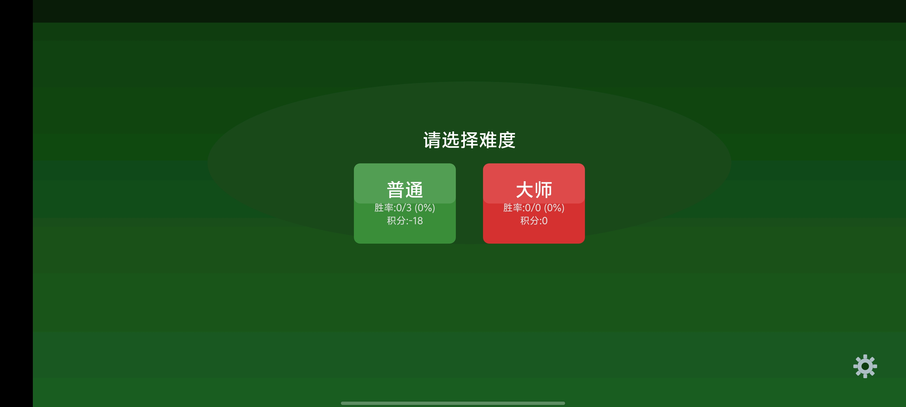
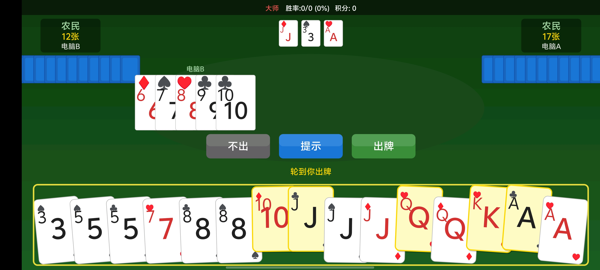
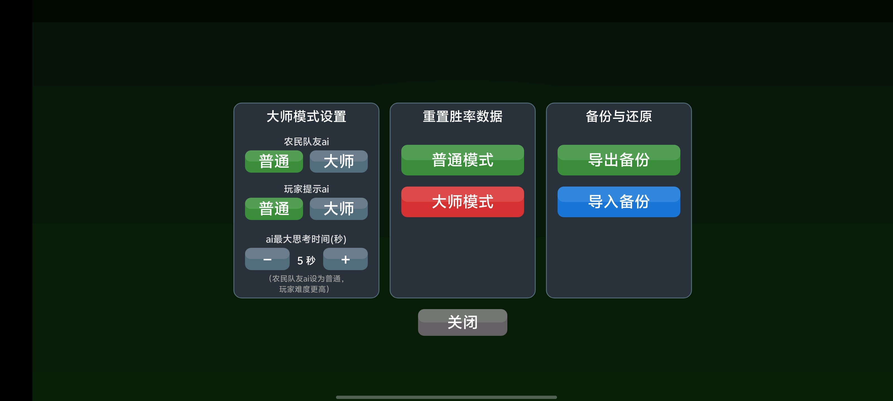

# Doudizhu (斗地主) 🃏

**安卓斗地主小游戏，为天下老妈们而开发：简单、安心、无广。**  
*(Landlord Poker Game on Android - Created specially for our moms, simple, secure and completely ad-free)*

---

## ✨ 特色功能 (Features)

- 🛡️ **纯净无广**：专为长辈量身打造，拒绝任何广告弹窗与诱导点击，绿色安心。
- 👵 **极简操作**：界面简洁大方，字体与按钮设计充分考虑长辈的视觉与操作习惯，轻松上手。
- 🤖 **智能单机**：内置单机 AI 陪练，支持**自定义 AI 思考时间设置**，您可以根据需求调节对局难度。
- 🔒 **安全可靠**：不索取非必要权限，不收集敏感隐私，保护长辈的手机安全。

---

## 🖼️ 界面预览

  <table>
    <tr>
      <td></td>
      <td></td>
      <td></td>
    </tr>
    <tr>
      <td align="center"><b>主界面</b></td>
      <td align="center"><b>游戏界面</b></td>
      <td align="center"><b>设置界面</b></td>
    </tr>
  </table>

---

### 核心玩法
- **完整游戏规则**：实现标准斗地主规则，包括叫分、出牌、炸弹、火箭等所有牌型
- **智能 AI 系统**：
  - **普通模式**：基于启发式规则的 AI 决策
  - **大师模式**：使用完美信息搜索算法的强大 AI
- **游戏统计**：按模式分别记录积分、局数和胜场，数据持久化保存、导入导出

### 游戏体验
- **流畅动画**：手牌逐张滑入动画、出牌动画等
- **音效反馈**：出牌音效、胜利音效、最后一张牌提醒音效
- **振动反馈**：
  - 大出牌（炸弹/火箭/）长振动
  - 剩最后一张牌特殊提醒振动
- **全屏显示**：沉浸式游戏体验

### 高级功能
- **大师模式设置**：
  - 农民队友 AI 策略调节（普通/大师）
  - 玩家提示 AI 策略调节（普通/大师）
  - AI 思考时间调节（2-60 秒）

---

## 📱 下载与安装 (Download)

您可以直接前往 [GitHub Releases](https://github.com/wishday/Doudizhu/releases) 页面，下载最新版本的 APK 安装包。

---

## 📄 开源协议

本项目基于 **GNU General Public License v3.0** 开源，详情请见 [LICENSE](LICENSE) 文件。

---

## 🤝 贡献指南

欢迎提交PR，尤其是音效或UI的大神们。

---

**❤️ 致所有妈妈：愿这款小游戏带给您轻松愉快的时光！**